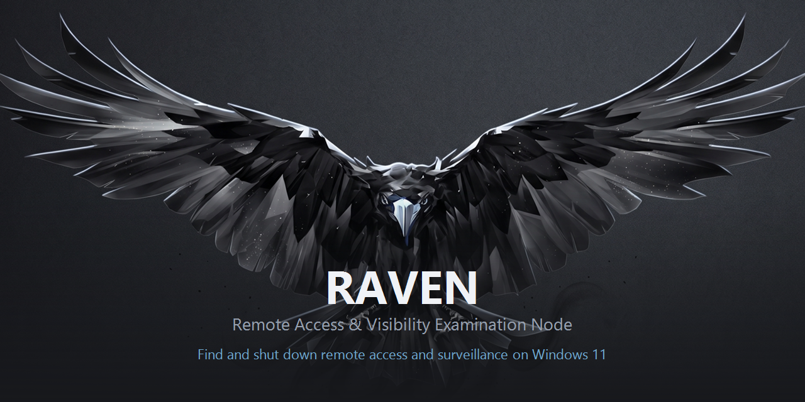
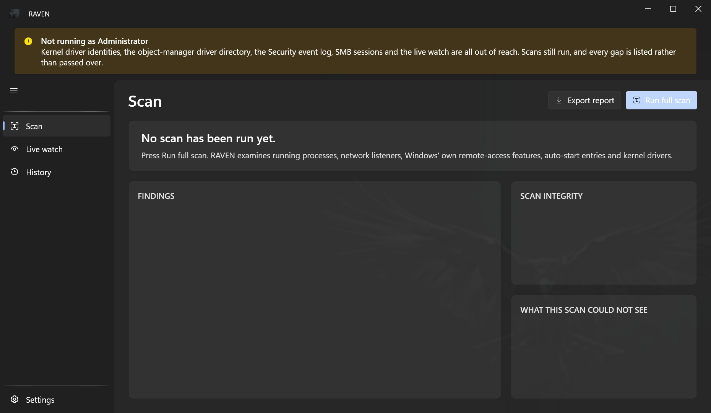
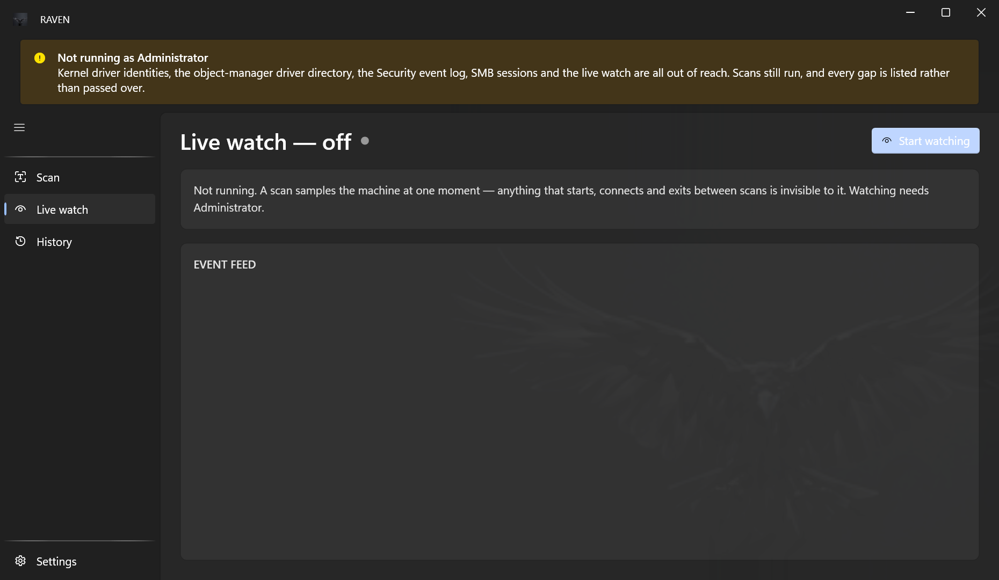

 

---

RAVEN looks for remote-access software, RATs, and screen or input surveillance running on
your machine — and then helps you stop it. It runs entirely on the local machine. There is
no server, no account, and nothing leaves the computer.

> [!IMPORTANT]
> RAVEN is in active development and has not been released. The published executable is
> currently unsigned, so SmartScreen will warn on first run.

---

## 🧭 The constraint that shapes everything

The original goal was *"iron proof — if this tool says nothing is spying on me, nothing
is."*

**That bar is unreachable, and pretending otherwise is the most dangerous thing a tool like
this can do.** A kernel rootkit, a hypervisor beneath Windows, or a hardware KVM-over-IP all
defeat any user-mode scanner. So RAVEN took a different commitment instead:

> Make it very hard for anything to hide, and make the residual blind spots **visible and
> named**.

Three things follow from that, and they are not adjustable:

| | |
|---|---|
| **It never says you are clean** | The verdict type has no `Clean` value *by construction*, and a test asserts the output never claims safety. Every verdict is qualified by what the scan could actually see. |
| **A discrepancy is the finding** | Processes and drivers are enumerated through several independent kernel interfaces and the results are diffed. Something visible to one interface and hidden from another *is* the result. |
| **Missing data is never a finding** | A privilege limit degrades coverage and adds a named blind spot. It never manufactures a detection — nearly every false positive this project has produced came from breaking that rule. |

Every scan ends with a **Scan Integrity** panel and an explicit *"what this scan could not
see"* list. Those are not footnotes; they are the product.

---

## 🖥️ What it looks like

 <em>The Scan view. Coverage is stated before any result is.</em>
  

 <em>Live watch — a scan samples one moment; this sees what happens between them.</em>

---

## 🔍 What it examines

| Surface | What RAVEN reads |
|---|---|
| **Processes** | Every running process and its trust status — Authenticode including **catalog** signatures, since most of Windows is catalog-signed and an embedded-only check would call half the OS unsigned |
| **Network** | TCP/UDP listeners and connections, attributed to the owning process |
| **Windows' own remote access** | RDP, RDP shadowing, WinRM, OpenSSH, Remote Registry, Remote Assistance, SMB, and `netsh portproxy` forwarding |
| **Persistence** | 17 auto-start surfaces — Run/RunOnce, startup folders, scheduled tasks, services, Winlogon, AppInit_DLLs, AppCertDlls, IFEO debuggers, COM hijacks, LSA packages, print monitors, netsh helpers, Active Setup, PowerShell profiles, WMI event subscriptions |
| **Kernel drivers** | The loaded-module list, registry registrations, and the `\Driver` object directory — three views that can disagree |
| **Surveillance** | Screen-capture correlation and the structural footprint of a global input hook |

---

## ✨ What else it does

- **Identifies known tools** from a catalogue of remote-access and RAT-family software —
  used as evidence *for* an identification, never as grounds to convict. A stale catalogue
  lowers confidence rather than raising severity.
- **Stops things, with your hand on it.** No remediation runs without a confirmation showing
  the exact command and its impact.
- **An allowlist that cannot quietly lie.** Every entry is pinned to the SHA-256 of the file
  it excuses, so swapping that file brings the finding straight back. Muted items stay listed
  on the same screen as everything else.
- **Remembers, and compares.** Each scan is recorded and diffed against the previous one —
  and a finding that disappeared is never reported as good news if this scan simply saw less.
- **Exports** to HTML or JSON, stating what the file contains before writing it.
- **Watches between scans** with real-time ETW tracing, for software that starts, beacons and
  exits before any scan would notice.

---

## 🛡️ Requirements

- Windows 11, x64
- **Administrator is requested at launch.** Without it, kernel driver identities, the
  `\Driver` object directory, the Security event log, SMB session data and the live watch are
  all out of reach.

> [!NOTE]
> Declining the prompt is fully supported. RAVEN keeps running with reduced coverage and says
> so, in a banner and on every scan. Elevation is *requested*, never demanded by the manifest
> — a tool that cannot demonstrate its own blind spots has no business claiming it has none.

---

## 🔒 Privacy

Everything stays on the machine. There is no server, no account, and no telemetry.

Scan history, the allowlist and baselines live in a local SQLite database. That database
records what is running on your computer — program paths, connections and usernames — so it
is worth treating like any other record of your machine. Exported reports contain the same
kind of detail, and RAVEN tells you that *before* it writes one.

---

<strong>Why does it refuse to tell me I'm clean?</strong>

 

Because it cannot know. RAVEN runs in user mode. Code running in the Windows kernel, in a
hypervisor beneath Windows, or in hardware attached to the machine can return clean answers
to every check it performs.

A tool that says "you're clean" is making a claim about things it did not look at. RAVEN
reports what it examined and what it could not — which is less comforting and considerably
more useful.

<strong>It flagged software I installed myself. Is that a bug?</strong>

 

No. Remote-access software is not malware, and RAVEN does not pretend to know whose machine
it is on. TeamViewer, RustDesk, VNC and their relatives are flagged because they *can* be
used against you, not because they are.

The question RAVEN is built to answer is the one only you can: *did you set this up?* If yes,
mute it — the entry is pinned to that exact file, so a swapped binary comes straight back.

<strong>Why does an unelevated scan find fewer things?</strong>

 

Because it can see less, and that is reported rather than hidden. Windows withholds kernel
image bases below high integrity, refuses the `\Driver` object directory, and closes the
Security event log.

RAVEN never treats "I could not look" as "there was nothing there". Those gaps are listed
individually on every scan, and a comparison against an elevated scan carries a caveat saying
the two are not equivalent.

---

## 🚧 Status

In active development, and not yet released. The published executable is unsigned, so
SmartScreen will warn on first run. Code signing is unresolved.

 
Built by <a href="https://github.com/Believeinus">Believeinus</a>

